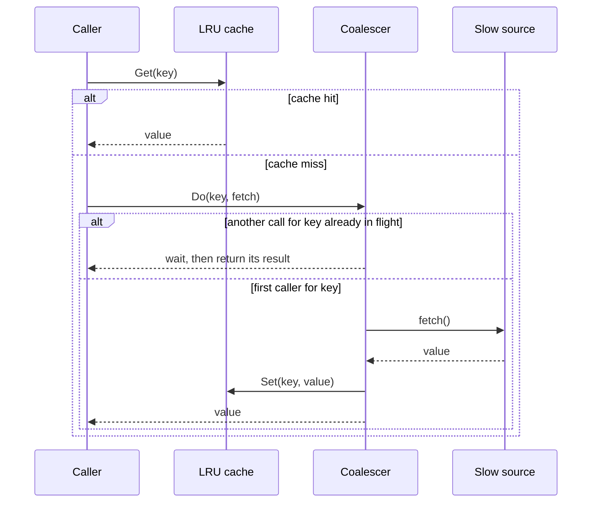
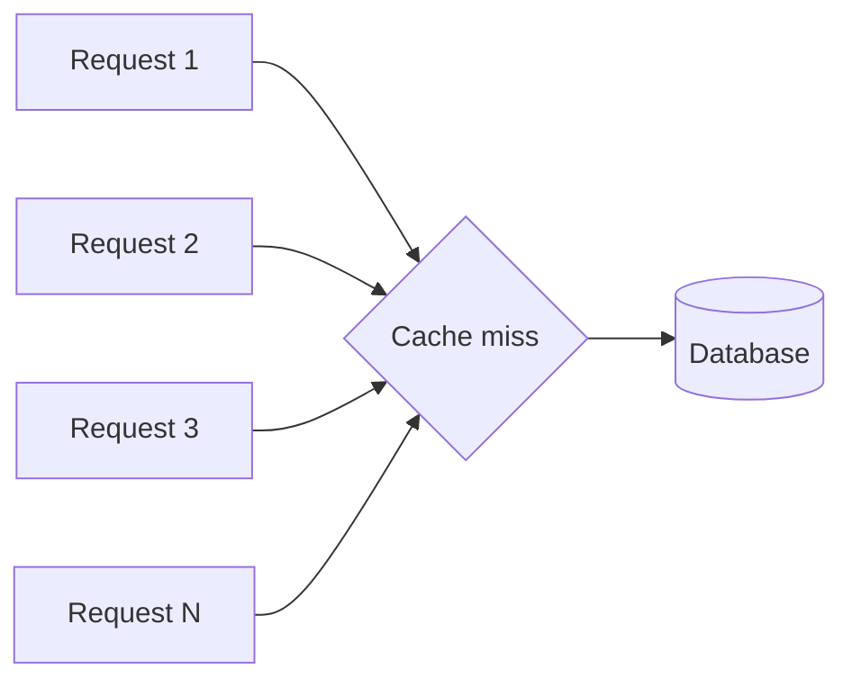
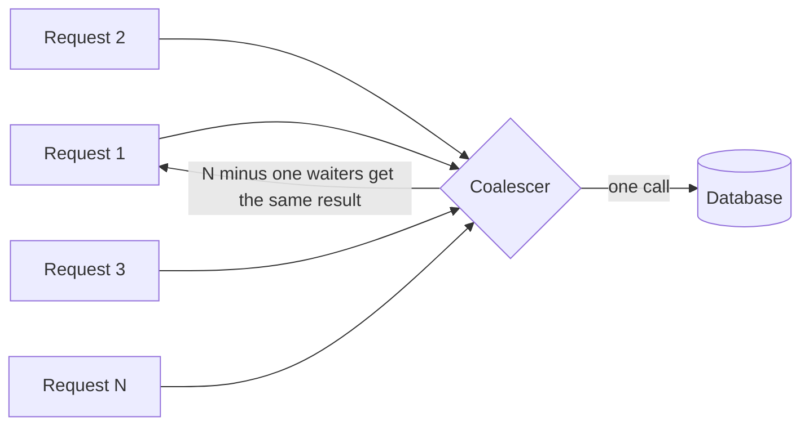

# Architecture

## Cache-aside read path

## The stampede, without coalescing

A hot key expires. N requests arrive before any of them finishes repopulating the cache. Every one of them sees a miss and goes straight to the database, N times, at the exact moment the database is least prepared for a spike.

## The fix

The coalescer lets the first request through and makes every other concurrent request for the same key wait on that one result instead of starting its own. Measured effect is in benchmarks/RESULTS.md.
