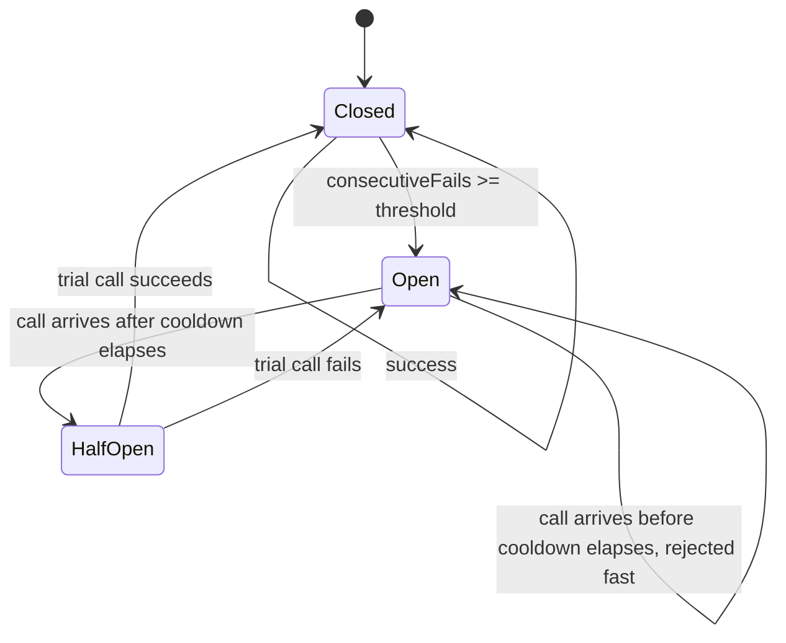
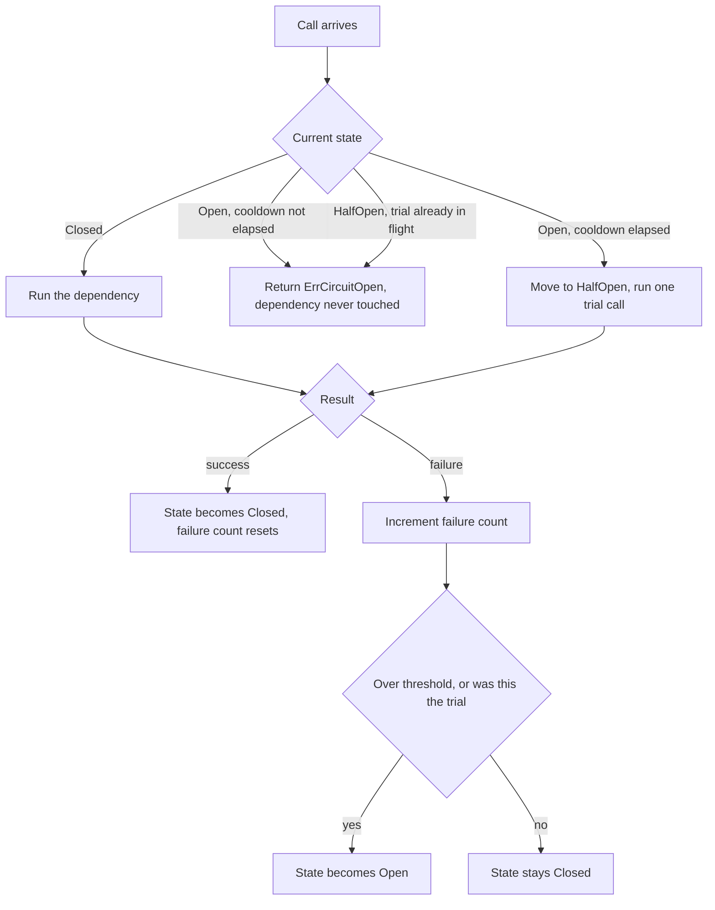

# Architecture

## The full cycle

## What each call does

The half-open state exists specifically to stop a flood of requests from all hitting a barely-recovered dependency at once. Only one trial call is allowed through; every other concurrent caller gets rejected until that trial resolves. See breaker.go's halfOpenInFlight field and the concurrency test in breaker_test.go.
