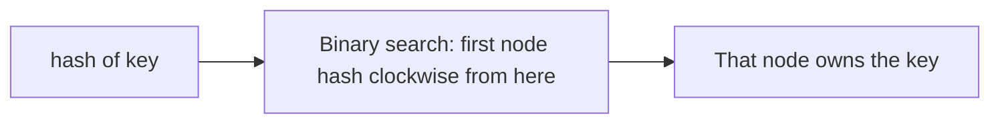
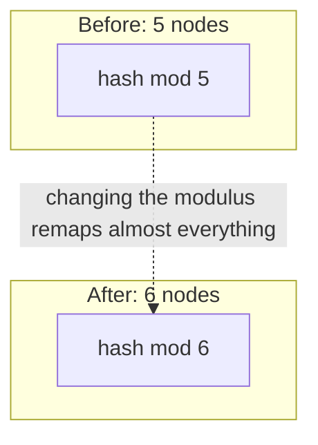
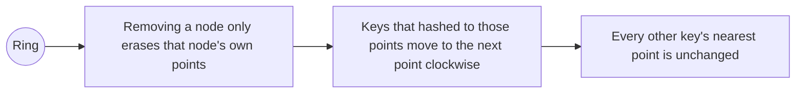

# Architecture

## How a lookup works

Every real node is hashed multiple times, `replicas` times, at points like `node-a#0`, `node-a#1`, and so on, and all of those hash values are kept in one sorted list. A lookup hashes the key once and binary searches for the next hash value at or after it, wrapping around to the start of the list if the key's hash is past the last node. See ring.go.

## Why naive mod-N breaks on scaling

hash(key) mod N depends on N. The instant N changes, by adding or removing a single node, most keys land on a different result than before, regardless of which specific node changed. Measured effect is in benchmarks/RESULTS.md.

## Why consistent hashing doesn't have this problem

Removing a node only removes that node's own points from the ring. Every key that wasn't pointing at one of those points still finds the same node it always did. Only the removed node's own share of keys has to move.
