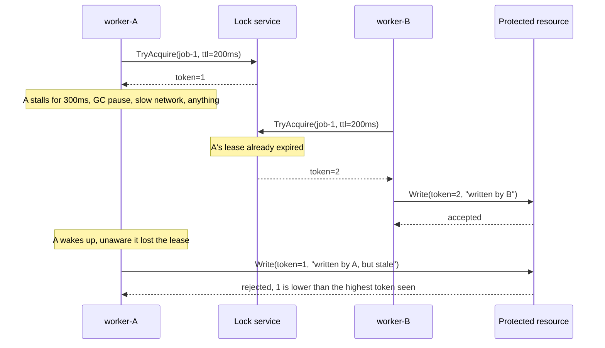
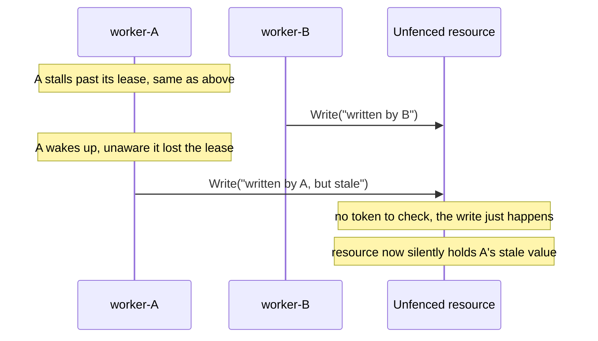

# Architecture

## The failure this lab is about

## Without fencing

The lock service correctly told B it now owns the lease. The problem was never the lock service, it was assuming that holding a lease and being allowed to write are the same guarantee. They're only the same guarantee if the resource itself checks a token.
