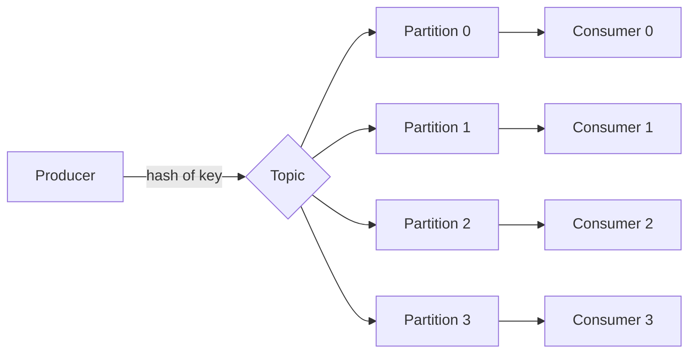
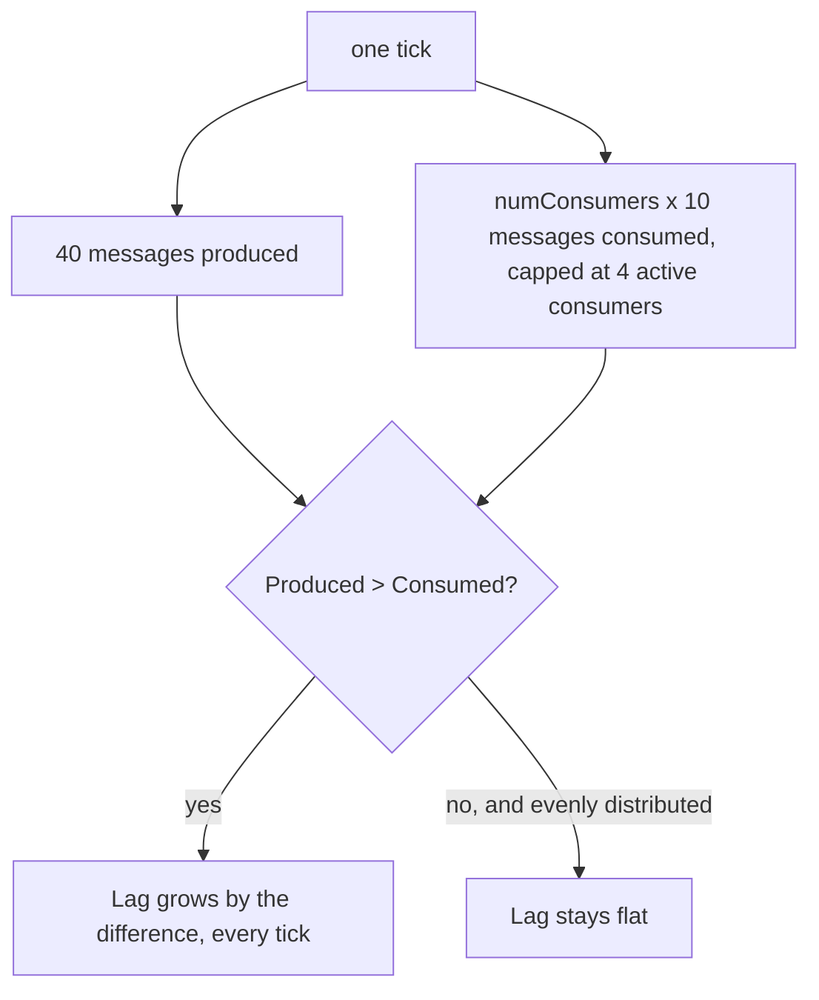
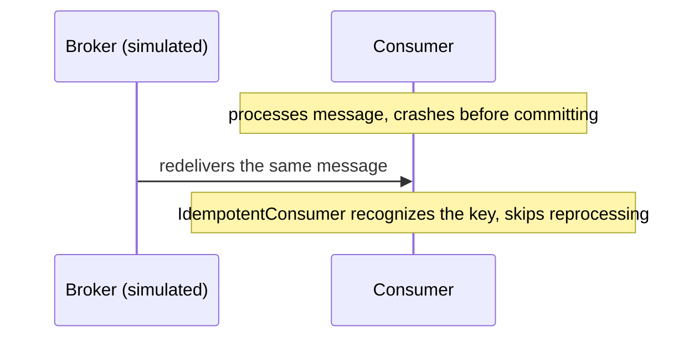
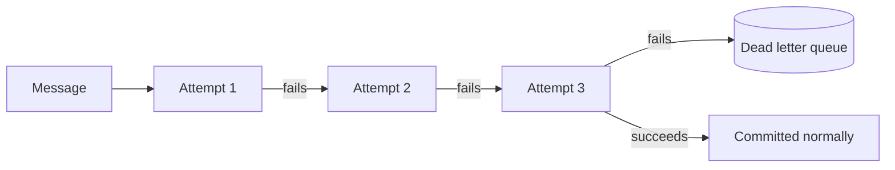

# Architecture

## Producing and consuming

Each partition is owned by exactly one consumer in the group at a time. That assignment, not the number of consumers, is what caps how much of the group's work can happen in parallel.

## Why lag grows

Measured numbers for four different consumer counts are in benchmarks/RESULTS.md, including the honest residual lag that shows up even when aggregate capacity matches aggregate production, because partition assignment doesn't guarantee a perfectly even split every tick.

## Idempotency and the DLQ

## Why this lab is a simulation

Neither a real Kafka broker nor a Go client library for one is reachable from this sandbox. Kafka has no standard Ubuntu package the way Postgres and Redis do, and the Go module proxy needed to fetch a real client library isn't reachable either, see the repository's ARCHITECTURE.md for the full list of what is and isn't reachable here. kafkasim models the parts of Kafka that actually matter for the lessons in this lab, ordered partitions, consumer group assignment, offsets, lag, idempotent consumption, dead lettering, as real, tested Go code, without depending on a broker this sandbox can't run.
