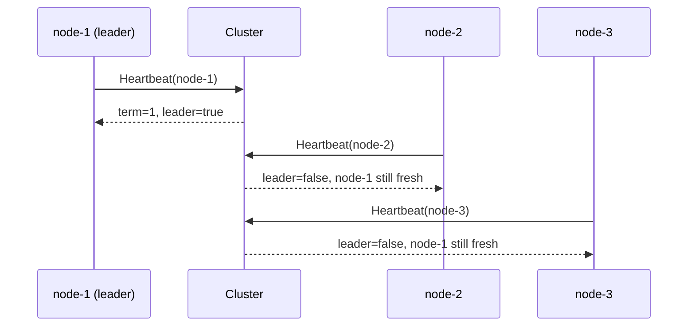
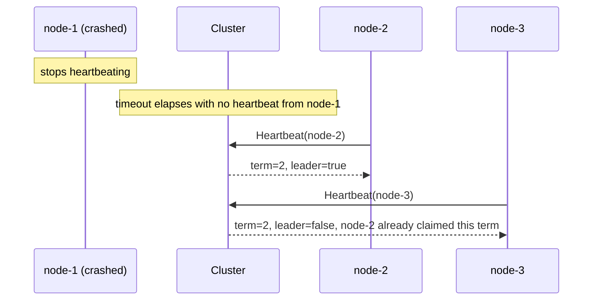

# Architecture

## Normal operation

## Leader goes silent, election happens

Whichever node's heartbeat reaches the cluster first after the timeout wins. This lab's Cluster is a single, shared piece of state, which is exactly what makes the race resolve cleanly to one winner. See the README's Scaling section for what changes once there's no longer one obviously correct copy of that state to check against.
