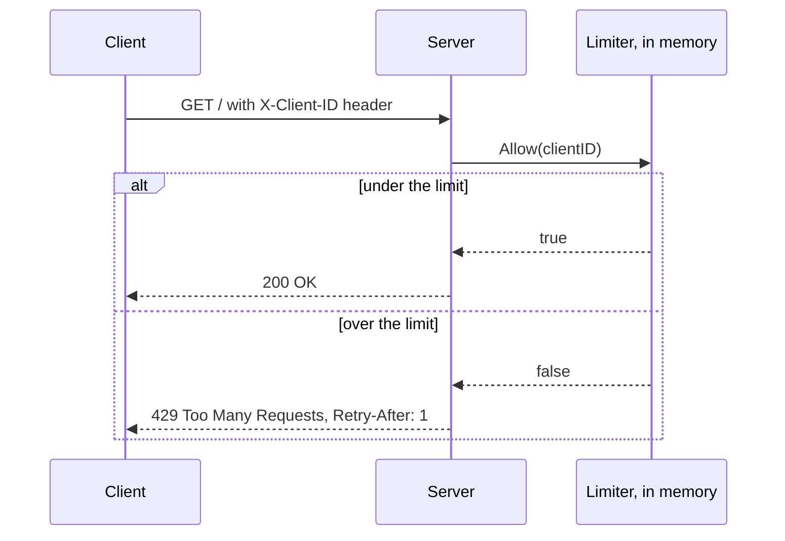
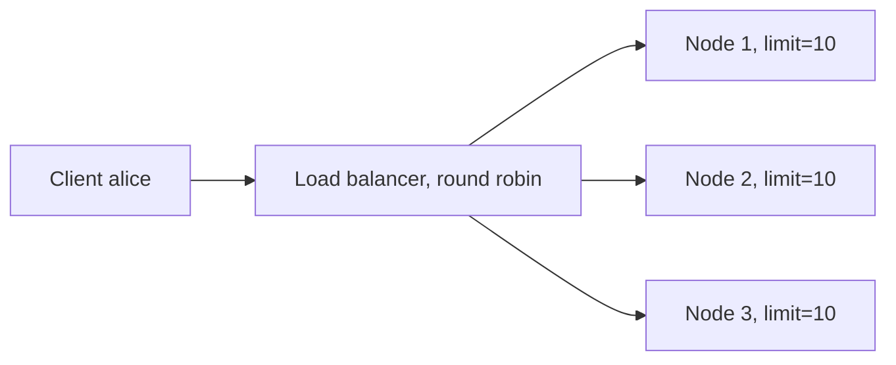
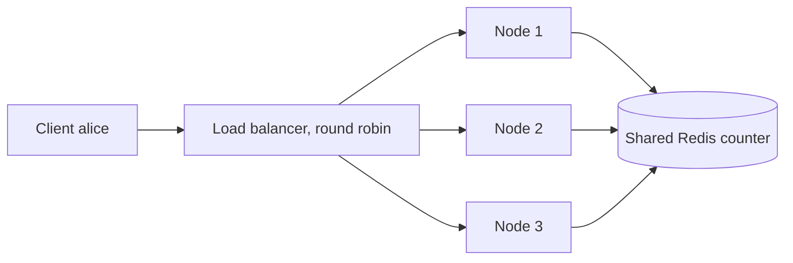

# Architecture

## Request flow, single node

## Failure mode: independent nodes, no shared state

Each node enforces its own limit correctly. The service as a whole does not, since none of the three nodes know the other two exist. Measured effect is in load-tests/RESULTS.md.

## What a fix looks like

Moving the counter into Redis, INCR plus EXPIRE for fixed window, or a small Lua script for token bucket to keep the check and decrement atomic, makes the limit correct across any number of nodes. The cost is a network round trip per request, and Redis becoming a hard dependency: if it's unreachable, the service has to pick between failing open or failing closed. This variant is on the roadmap for this lab, not built yet.
