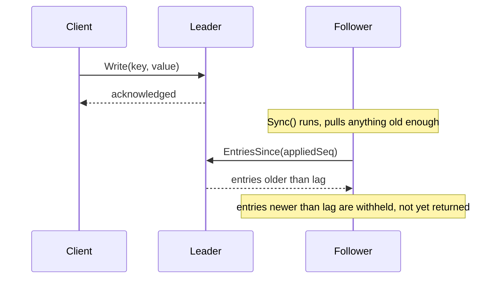
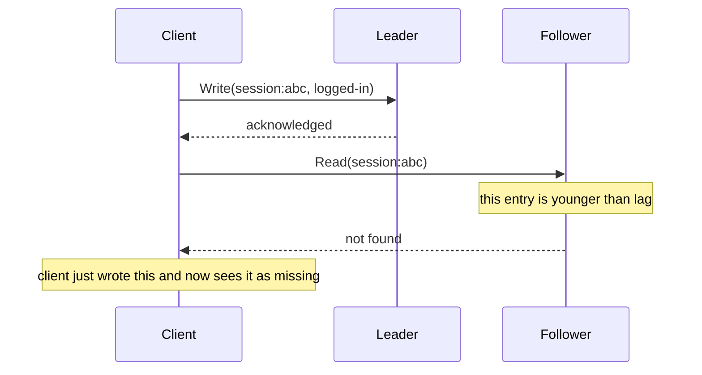

# Architecture

## Normal operation

## The read-your-own-write problem

Nothing is broken here. The follower is doing exactly what an asynchronous replica is supposed to do, applying writes a little after they happen. The bug, if there is one, is in the client assuming a write is visible everywhere the instant the leader acknowledges it. See the README's Failure Modes section for the measured effect of different lag values.

## Why this lab is a simulation

A real Postgres primary and standby were set up in this sandbox during development of this lab. wal_level was already replica by default, pg_basebackup worked, the standby reached a consistent recovery state and correctly reported pg_is_in_recovery() as true. What didn't hold up was keeping a server running across separate tool invocations in this environment, the primary process didn't reliably survive between them, which made a real write-then-read-from-standby demonstration too flaky to ship as a repeatable result. The simulation in leader.go and follower.go models the same mechanism, an ordered log a follower asynchronously applies with a configurable delay, without depending on a long running external process.
