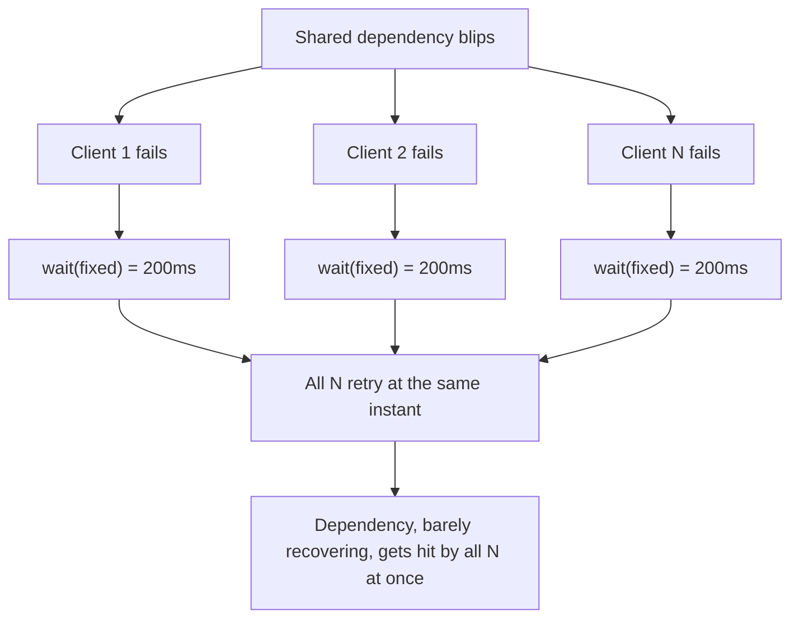
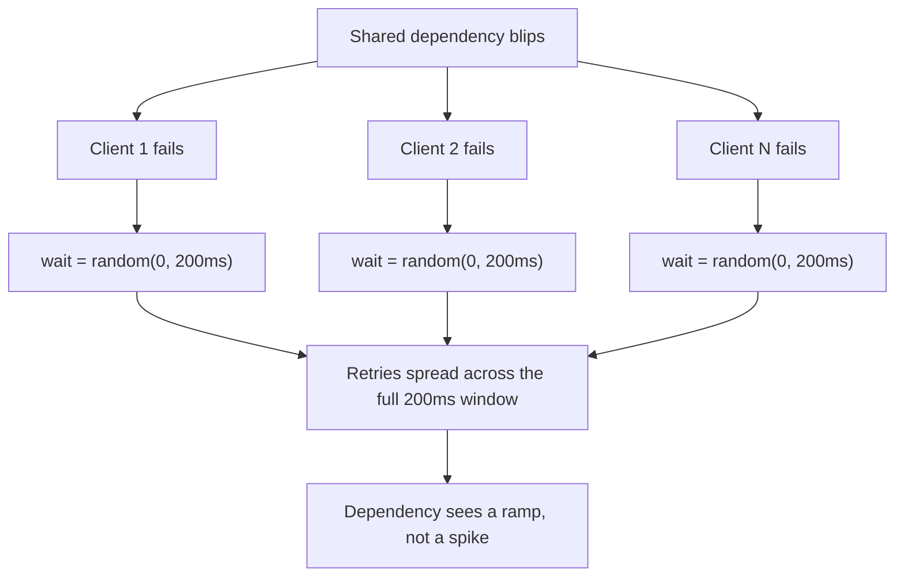

# Architecture

## The storm

## The fix

Every client still retries within the same overall budget, up to 200ms. The only change is that each one picks its own moment inside that window instead of all picking the same one. Measured effect is in benchmarks/RESULTS.md.
