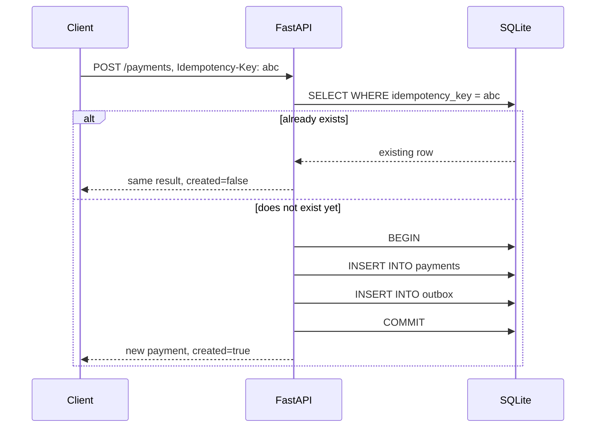
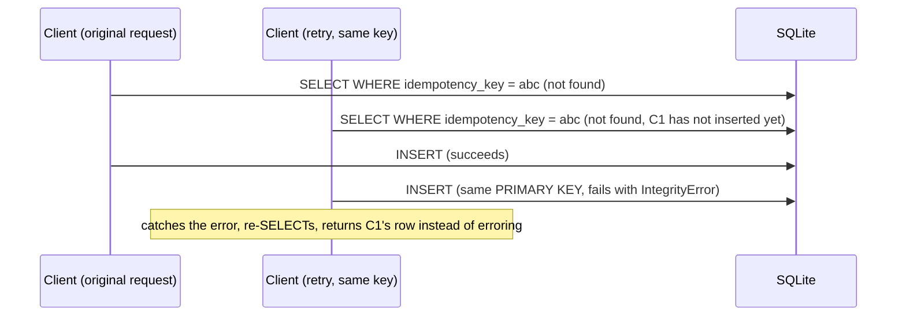
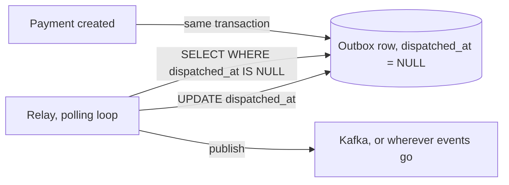

# Architecture

## Creating a payment

## The race the SELECT alone cannot prevent

The initial SELECT is only a fast path for the common case where the first request already committed by the time the retry arrives. What actually makes this safe under real concurrency is the PRIMARY KEY constraint on idempotency_key and the code path that catches its violation, not the SELECT. See tests/test_payments.py's concurrent test, and the same result reproduced for real over HTTP in benchmarks/RESULTS.md.

## The outbox relay

If the relay crashes between publish and the UPDATE, the event gets published again on the next poll, at least once delivery, not exactly once. That's not a flaw to fix later, it's why labs/kafka-messaging's IdempotentConsumer exists: the outbox guarantees no event is ever lost, and an idempotent consumer on the receiving end is what turns at-least-once into effectively-once. Neither piece alone is the whole answer.

## Why SQLite instead of a real client-server database

Postgres was the original plan, and it was tried, for the replication lab first. It installs and runs fine in this sandbox, but a running server process does not reliably survive between separate tool invocations here, which is a sandbox limitation, not a real production constraint. SQLite needs no separate server process at all, it is a library linked into this process, so it has none of that problem, while still giving real ACID transactions and a real PRIMARY KEY constraint enforced by the engine, which is everything this system's two guarantees actually depend on.
