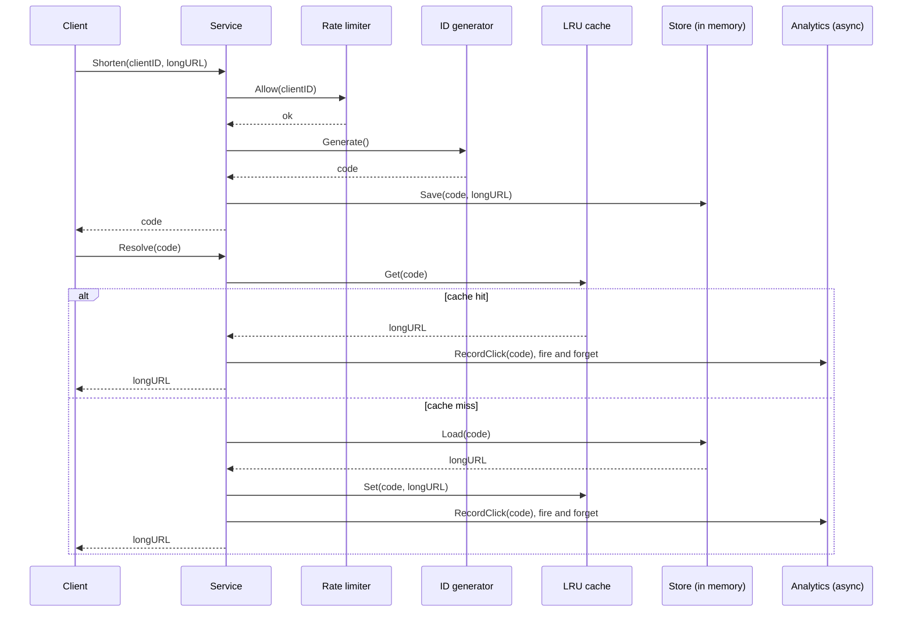
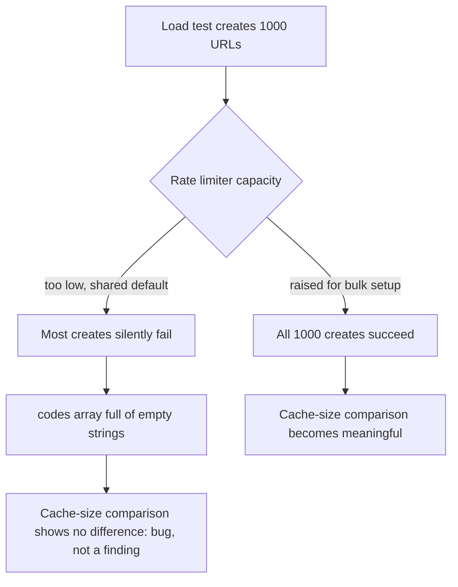
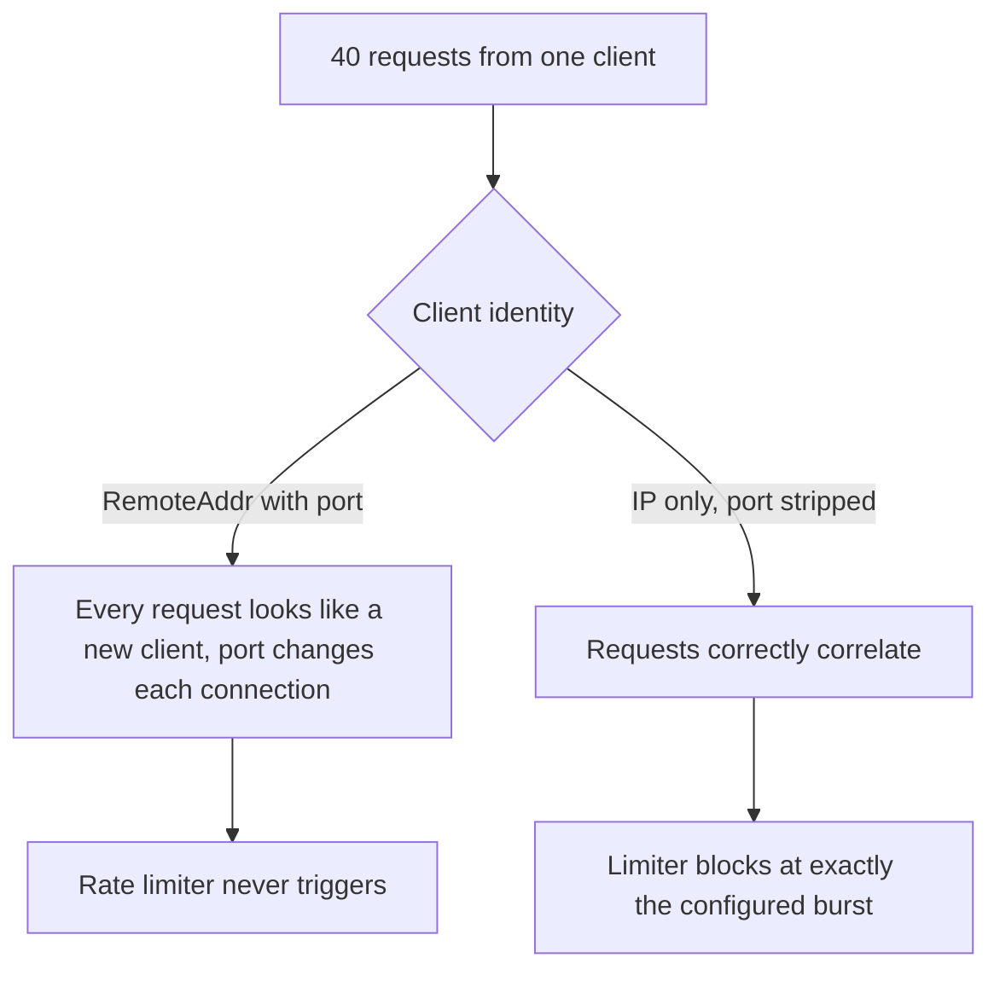

# Architecture

## Request flow, this version



## The evolution this system is built to show

```text
V0  Single process, in-memory store              <- this system, as built
V1  + LRU cache in front of the store             <- this system, as built
V2  + async analytics, abuse-prevention limiter   <- this system, as built
V3  + persistent store (Postgres), survives a restart      <- documented next step, not built
V4  + horizontal scaling: multiple stateless app servers    <- documented next step, not built
V5  + shared cache (Redis) instead of one per process       <- documented next step, not built
V6  + read replicas / sharded store for write and read scale <- documented next step, not built
V7  + multi-region                                <- documented next step, not built
```

This system currently occupies V0 through V2: a single process, but already cached, abuse-guarded, and asynchronous where the redirect path benefits from it. See the README's Scaling section for what V3 onward would actually require, and why V3 specifically was attempted and then deliberately not built in this sandbox.

## Why persistence stops at in-memory

A real Postgres-backed store was attempted for this repository's replication lab first. Postgres itself installs and runs fine in this sandbox, but a running server process does not reliably survive between separate tool invocations here, which makes depending on one across a multi-step build unreliable enough that it isn't used as this system's actual store. The Store interface in internal/store is written so a Postgres-backed implementation is a drop-in: anything satisfying Save, Load, and Exists works, the Service and everything above it never needs to change.

## Two bugs the load test itself caught





Both are documented with their measured before-and-after in benchmarks/RESULTS.md.
